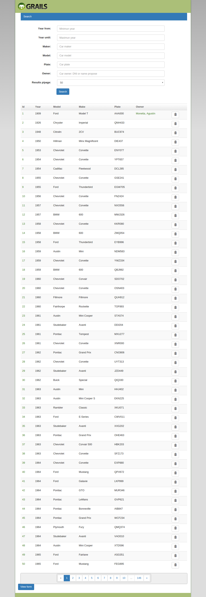

# CarsKTZ
CarsKTZ is a REST API and simple CRUD end-user application also, that id provides a simple way to get cars models from database as a simple JSON format.

Building with Grails, this app is a training for the use of Grails and have also may interesting examples.

---

#### Technologies & Requisites
-  [Tomcat]() 7
-  [Grails]() 2.3.7*
-  [Java SDK]() 1.7*
-  [JQuery]() 1.4.2
-  [HTML5]()
-  [Bootstrap 3]()
-  [MySQL]() 5.6.29*
-  [Hibernate]() (via GROM)

#### Relevant plugins
- [Tomcat](https://grails.org/plugin/tomcat) (7.0.55.3)
- [WSlite](https://grails.org/plugin/wslite) (0.7.2.0) | REST Client plugin
- [jQuery Plugin](https://grails.org/plugin/jquery) (1.11.1)
- [jQuery-UI](https://grails.org/plugin/jquery-ui) (1.10.4) | Visual plugin for JQuery
- [twitter-bootstrap](https://grails.org/plugin/twitter-bootstrap) (3.3.5) | Bootstrap 3

--
Data source provided by [n8bar](https://github.com/n8barr) at [automotive-model-year-data](https://github.com/n8barr/automotive-model-year-data)
* This require manual installation

## REST API
For develop your own consumer app for this API, here a simple guide

### GET
For accessing the API use:

    http://your.host/carsktz/car/api

For getting a full list of entities, use:

    http://your.host/carsktz/car/api

and the response will have the format:

    {
    "cars": [
        {
            "id": 1,
            "make": "Ford",
            "plate": "AAA000",
            "year": 1909,
            "owner": {
                "class": "com.kaitzen.Owner",
                "id": 1,
                "apellido": "Apellido",
                "cars": [
                    {
                        "class": "Car",
                        "id": 1
                    }
                ],
                "dni": 36547326,
                "nacionalidad": "Argentino",
                "nombre": "Nombre"
            },
            "model": "Model T"
        }, ...
    }

Pay attention that there is an array of cars so, if you try to access in code would be like:

    response.json.car[0]

and NOT:

    response.json[0]

Also you are able to add parameter to restrict result:
- from
- to
- make
- model
- owner

For the first for ones, there is nothing tricky: 

`from` and `to` limit min and max year response like:

    http://your.host/carsktz/car/api?from=1950&to=1980

this will return something like:
    
    {
        "cars": [
            {
                "id": 4,
                "model": "Minx Magnificent",
                "plate": "DIE437",
                "year": 1950,
                "owner": null,
                "make": "Hillman"
            },
            {
                "id": 5,
                "owner": null,
                "model": "Corvette",
                "make": "Chevrolet",
                "plate": "ENY077",
                "year": 1953
            }, ...
    }

`make` and `model` are proposes of values like:

    http://your.host/carsktz/car/api?make=fo

returns any car whose contains `make` property similar to "fo" without case sense. 

    {
        "cars": [
        ...
            {
                "id": 9,
                "model": "Thunderbird",
                "plate": "EGW705",
                "owner": null,
                "make": "Ford",
                "year": 1955
            }, ...
    }

`owner`, otherwise, has its own logic, accepts numeric values and literals
- as numeric: `owner` is understood as owner DNI and query will return cars whose owner DNI is equal to given one
- as literal: `owner` is understood as owner name propose (name or surname) and query will return cars whose owner name or surname are like given one
 
 Finally, and as you have saw, you can provide some, all or no param to the query as your needs.
 
### GET & UPDATE

For retrieving a single car user throw `GET` request `http://your.host/carsktz/car/api/` + `id`

    http://your.host/carsktz/car/api/1011

For editing use the same url, where `id` is the id of the object to be updated, but `POST` method instead `GET` with JSON body with format:

    {
        "id": integer,
        "model": "string",
        "plate": "([A-Z]{3})(\d{3}) | ((D|C|I|M|A)\d{3}(CP|DM|RX|AC|DC)[A-Z])",
        "owner": (null | Class com.kaitzen.Owner),
        "make": "string",
        "year": integer (min: 1768, max: today)
    }

Note that this API only accepts valid argentinian plates, civil and diplomatic ones.

### SAVE & DELETE 

For adding new one, idem before without `id`. The response (in case all validation are passed and no database error) will be the same provided object with new id.

For deleting an object use `DELETE` method like `GET` example and server will response with the deleted object on successful.

--
If you are trying out this API, we suggest to use [Boomerang plugin](https://chrome.google.com/webstore/detail/boomerang-soap-rest-clien/eipdnjedkpcnlmmdfdkgfpljanehloah?utm_source=gmail) for chrome.

## Visual CRUD
*CarsKTZ* includes a visual interface to see the API in action accessing:

    http://your.host/carsktz/car/index

This view makes a call to REST API to retrieve cars, make search, edit selecting one from table and create.

## About development

*CarsKTZ*, as any other application developed with grails and as good-programing technic, use MVC pattern to separate logic and data from how data is rendered.

As main `View` you will find `car/index` at project folder:

    grails-app/views/car/index.gsp

This one contains the car's CRUD and use templates and jQuery to axaj requests. Tested yourself performing a serach with some parameters and see how only table contect is refreshed.

### Grails Schema

If you are new in grails, would be useful to know that `grails-app/view` es default folder for all views. Next folder represents corresponding controller, ex. `grails-app/view/car`. Finally, the las one part is the specific view, or templates if begins with `_` .

Under `grails-app/controller` there is two relevant ones: `CarController` and  `CarRestController`:
- `CarController` is `car/index` controller. Its work is render main view and make REST calls to API.
- `CarRestController` is `car/api` controller and its work is only provide REST service (`GET`, `POST`, `PUT`, `DELETE`).